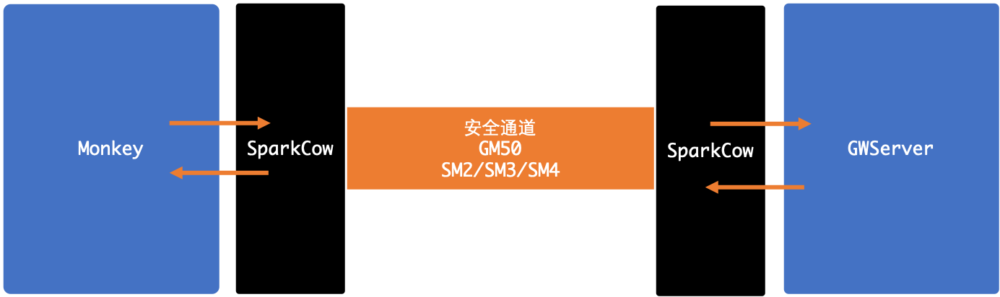

## 物联网终端接入服务

> 2020.8  scott   wx:itsec2018
> 
> 系统提供简易的物联网设备接入实现，集成了安全加密通道（类似vpn），符合国密设备接入要求。

### 1.服务列表

*1.GWServer*

> iot 设备接入网关服务，接收设备消息转发到MX ， 并从MX接收控制消息转发下行设备

*2.PapioMonkey* 
> 终端设备管理代理 (managed object) ,采集设备数据并上报到 GWServer 

*3.SparkCow* 
> 加密传输安全通道，符合GM50标准。 
> 在PapioMonkey与GWserver之间树立一对SparkCow服务来提供安全屏障，SparkCow之间采用GM协商
并加密

### 2. 设计

1. **系统结构**

1. **Monkey and GWServer**

1. **Secure Channel**

1. **Secure Channel**
